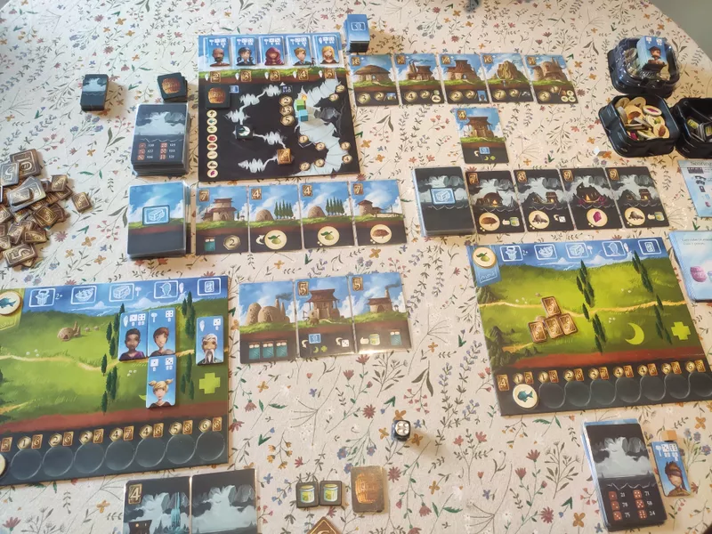

O *Above and Below* é um jogo competitivo onde cada jogador procura construir uma nova e próspera aldeia, após a anterior ter sido atacada por bárbaros.
Durante esta construção, os habitantes descobrem uma vasta rede de túneis subterrâneos cheios de mistérios e riquezas a ser explorados.

<!--more-->

Os jogadores têm como objectivo principal construir uma vasta aldeia, cheia de infraestruturas. Para tal precisam de recursos humanos, monetários e alimentares que podem ser encontrados, maioritariamente, ao explorar uma vasta rede de túneis desconhecidos. Esta exploração é alimentada por histórias pré-definidas que o jogador terá de viver e tomar decisões do que fazer em situações muito variadas, inspiradas em jogos RPG.

Um jogo estratégico e divertido especialmente pela componente de *storytelling* que torna cada jogo numa nova e inesperada experiência.

### Características

- **Duração**: 90 minutos
- **Jogadores**: 2 a 4 (melhor experiência com 3)
- **Idade**: acima de 13 anos
- **Complexidade**: 2.52/5 (média)
- **Recursos**: [BGG](https://boardgamegeek.com/boardgame/172818/above-and-below)
- **Dono**: Luís Pereira
