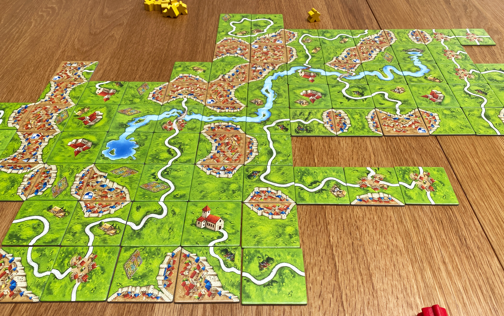

O *Carcassonne* é um jogo de colocação de peças onde os jogadores constroem em conjunto a paisagem francesa medieval, competindo para marcar pontos através de cidades, estradas, mosteiros e campos.

<!--more-->

Cada jogador, no seu turno, coloca uma peça de terreno no tabuleiro em construção e pode decidir colocar um dos seus seguidores numa das características dessa peça (campo, estrada, cidade, etc.).

O jogo combina elementos de cooperação, dado que todos contribuem para construir a paisagem, com competição estratégica pela colocação dos seguidores e controlo das áreas mais vantajosas. As decisões são simples mas significativas: onde colocar a peça e se vale a pena "investir" um seguidor nessa jogada.

As regras aprendem-se rapidamente, mas cada partida traz configurações, decisões, parcerias e inimigos diferentes!

O jogo base oferece uma experiência completa, mas existem numerosas expansões disponíveis que adicionam novas mecânicas e variedade para quem pretende explorar ainda mais este universo.

### Características

- **Duração**: 30 a 45 minutos
- **Jogadores**: 2 a 5 (melhor experiência com 3 a 4)
- **Idade**: acima de 7 anos
- **Complexidade**: 1.9/5 (baixa)
- **Recursos**: [BGG](https://boardgamegeek.com/boardgame/822/carcassonne)
- **Dono**: Leonel Araujo
