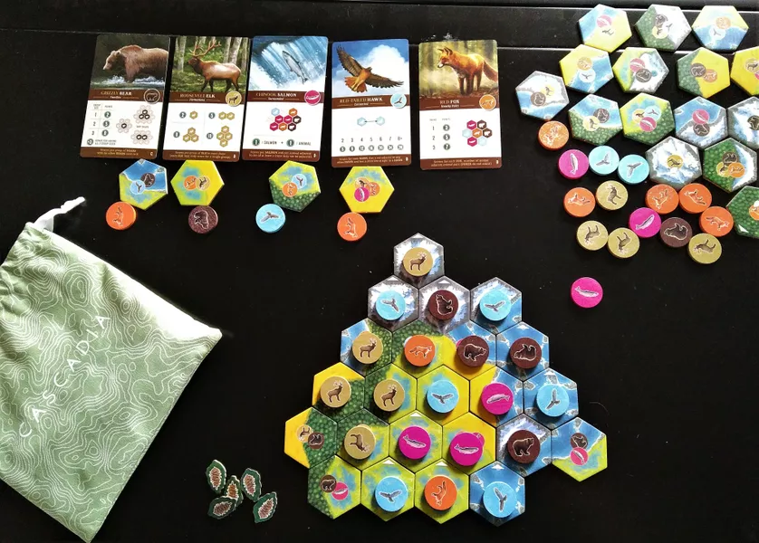

O *Cascadia* é um jogo competitivo onde os jogadores constroem o melhor ecossistema de vida selvagem baseado em espécies dessa mesma localização.

<!--more-->

Cada jogador trabalha num puzzle composto por peças de diferentes ecossistemas (aquático, deserto, florestal), posteriormente populados por animais selvagens, procurando cumprir o maior número de objetivos e arrecadar o prémio de melhor habitat.

Um jogo simples, de fácil compreensão e um ritmo rápido, ideal para momentos bem passados e relaxantes.

### Características

- **Duração**: 30 a 45 minutos
- **Jogadores**: 1 a 4 (melhor experiência com 3)
- **Idade**: acima de 10 anos
- **Complexidade**: 1.85/5 (baixa)
- **Recursos**: [BGG](https://boardgamegeek.com/boardgame/295947/cascadia)
- **Dono**: Luís Pereira
