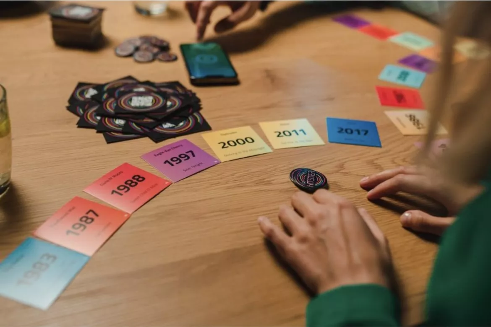

O *Hitster* é um jogo onde os jogadores devem ordernar músicas por ordem cronológica na sua linha temporal pessoal, testando o conhecimento musical de diferentes épocas.

<!--more-->

Para cada jogador, por ordem, retira uma carta do baralho. O DJ está encarregue de tocar um excerto dessa música, enquanto que o jogador deve colocar essa carta na posição cronológica correta da sua linha temporal pessoal, baseando-se no ano de lançamento da música.

O jogo combina conhecimento musical com palpites educados. - às vezes a música é reconhecida imediatamente, outras vezes é preciso confiar na intuição sobre o estilo e sonoridade da época. O primeiro jogador a conseguir uma linha temporal com 10 cartas ganha.

Perfeito para festas e encontros onde se quer criar um ambiente descontraído e cheio de música. Funciona especialmente bem com grupos que apreciam música e gostam de testar os seus conhecimentos.

### Características

- **Duração**: 20 a 40 minutos
- **Jogadores**: 2 a 10+ (melhor experiência com 4 a 8)
- **Idade**: acima de 16 anos
- **Complexidade**: 1.0/5 (baixa)
- **Recursos**: [BGG](https://boardgamegeek.com/boardgame/374174/hitster)
- **Dono**: Leonel Araujo
